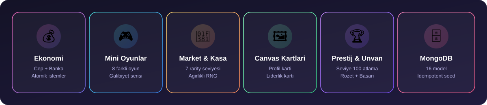
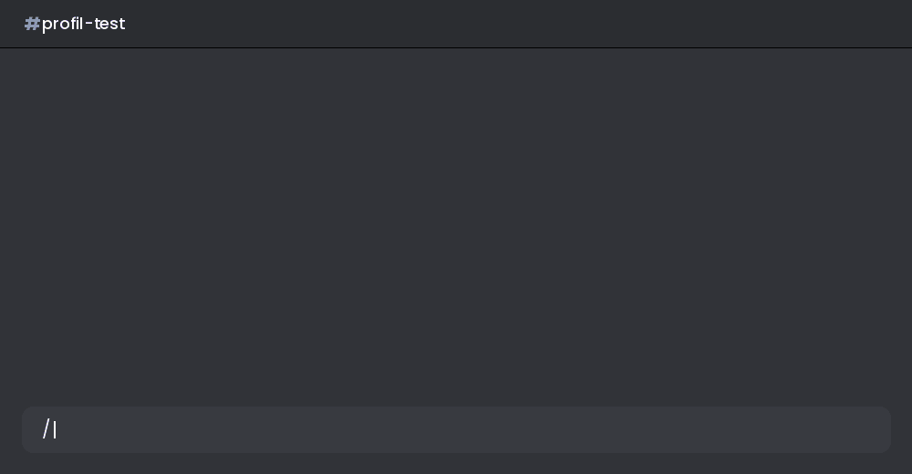
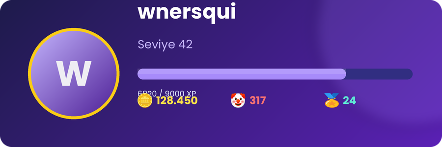
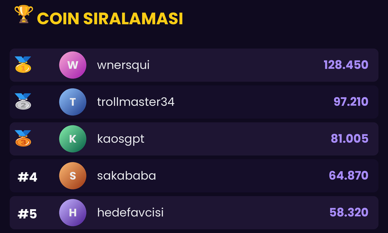
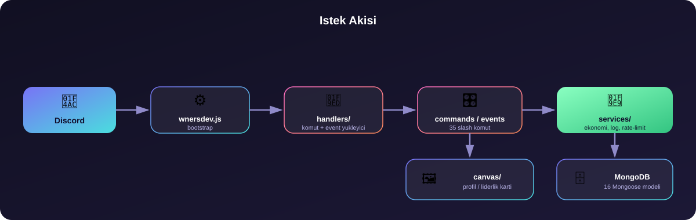

<div align="center">


<br/>

[](https://nodejs.org)
[](https://discord.js.org)
[](https://www.mongodb.com)
[](#)
[](#)

**Slash-only • MongoDB destekli • Components V2 • Canvas kartlarina sahip eglence Discord botu**

Marka: **wnersdev**

</div>

> Bu README, projeyi sifirdan kurup calistirmak isteyen biri icin yazilmistir.

<br/>

<div align="center">

</div>

<br/>

## 🎬 Canli Demo

<div align="center">


<sub>`/profil goruntule` calistirildiginda gercek botun urettigi Canvas karti boyle gorunur</sub>
</div>

<br/>

## 🖼️ Canvas Ciktilari

Bot, `node-canvas` ile **gercek zamanli PNG** uretir — asagidakiler `src/canvas/` icindeki kod ile birebir ayni tasarimdan alinmis ornek ciktilardir (demo veriyle).

<table>
<tr>
<td align="center" width="55%">

**`/profil goruntule`**
<br/>


</td>
<td align="center" width="45%">

**`/siralama coin`**
<br/>


</td>
</tr>
</table>

---

## 📦 Icerik

- Slash-only komut sistemi (prefix yok, Turkce isimler) — **35 komut dosyasi**
- Troll merkezi, hedef sistemi, sakalar, roast, ovgu, kader, troll testi, troll IQ — hepsi zararsiz/eglence amacli
- Gercek calisan mini oyunlar: yazi-tura, zar, tas-kagit-makas, sayi tahmin, hizli tikla, hafiza, kelime, duello — MongoDB'ye kaydedilir, guncel/en uzun galibiyet serisi takip edilir
- **Ekonomi**: cep + banka (atomik islemler, race-condition korumasi), `/bakiye`, `/banka`, `/para-gonder`, `/gunluk`, `/haftalik`
- **Market + Envanter + Kasa**: 7 rarity seviyesi (Yaygin → Gizli), gercek agirlikli RNG ile kasa acma, satin alma/satis, sayfalanmis envanter
- **Prestij + Unvan**: seviye 100'de prestij atlama, kazanilan unvanlari profilde secme
- Gorev sistemi (gunluk gorevler, ilerleme takibi, odul talebi)
- Rozet ve basari sistemi
- Canvas ile profil ve liderlik kartlari
- Discord.js **Components V2** (Container/TextDisplay/Section/Separator) kullanan paneller
- MongoDB + Mongoose modelleri (16 model), idempotent katalog seed sistemi
- Sayfalanmis gecmis goruntuleme (`/gecmis`), kullanici bilgi komutu
- Sunucu ayarlari, log kanali yonetimi, gelistirici-only yonetim komutlari (bakim modu, reload, cache, tanilama testleri)
- Kullanicinin kendi verisini goruntuleme/disa aktarma/silme komutu (`/veri`)
- Redis varsa kullanan, yoksa memory fallback'e dusen rate limit servisi
- Turkce varsayilan, altyapi İngilizce'yi de destekler (`src/locales/`)

<details>
<summary><b>🚧 Bu surumde bilerek eklenmedi (kapsam disi birakildi, sahte/placeholder yapilmadi)</b></summary>
<br/>

Talep edilen kapsam cok genisti (moderasyon, ticket, boss, turnuva, takim, sezon, cekilis, anket ve hepsini kapsayan dashboard). Bunlari yarim yamalak/sahte olarak eklemek yerine, **gercekten calisan** bir cekirdek (ekonomi + market + kasa + prestij/unvan) tamamlandi. Su sistemler henuz yok:

- Moderasyon (`/ban`, `/at`, `/sustur`, `/uyar` vb.)
- Ticket sistemi
- Boss / Turnuva / Takim / Sezon sistemleri
- Cekilis ve Anket
- Web Dashboard (proje talebinde de "core sistemler bittikten sonra" baslanmasi istendi)

İstersen bir sonraki adimda bunlardan hangisini once istersen onu ekleyeyim.

</details>

---

## 🚀 Kurulum

<div align="center">

</div>

### 1) Gereksinimler

| Gereksinim | Detay |
|---|---|
| 🟢 **Node.js** | [nodejs.org](https://nodejs.org) — 18 veya uzeri |
| 🍃 **MongoDB** | [mongodb.com](https://www.mongodb.com/) — yerel ya da Atlas |
| 🤖 **Discord App** | [Developer Portal](https://discord.com/developers/applications) |

### 2) Discord Developer Portal ayarlari

1. https://discord.com/developers/applications adresinden yeni uygulama olustur.
2. **Bot** sekmesinden bir bot olustur, **Token**'i kopyala.
3. **Privileged Gateway Intents** kismindan `Server Members Intent` ve `Message Content Intent`'i ac (bot, hafiza/kelime oyunlari icin mesaj icerigini okur).
4. Botu sunucuna eklemek icin **OAuth2 → URL Generator**'dan `bot` ve `applications.commands` scope'larini secip olusan linki kullan.

### 3) Projeyi indir ve bagimliliklari kur

```bash
npm install
```

### 4) Ayarlari doldur

```bash
cp ayarlar.example.json ayarlar.json
```

Icini doldur:

```json
{
  "discord": {
    "token": "BOT_TOKENIN",
    "clientId": "UYGULAMA_CLIENT_ID",
    "guildId": "TEST_SUNUCU_ID (opsiyonel, komutlarin aninda gorunmesi icin)"
  },
  "database": {
    "mongodb": "mongodb+srv://...  veya  mongodb://localhost:27017/wnersdev"
  },
  "developers": ["GELISTIRICI_DISCORD_ID"]
}
```

> ⚠️ **Onemli:** `ayarlar.json` dosyasi `.gitignore` icinde — GitHub'a asla gercek token ile commit edilmez.

**Alternatif: `.env` kullanmak istersen**, `.env.example` dosyasini `.env` olarak kopyala ve doldur. `.env` icindeki degerler (`DISCORD_TOKEN`, `DISCORD_CLIENT_ID`, `DISCORD_GUILD_ID`, `MONGODB_URI`), `ayarlar.json` icindeki karsiliklarinin onune gecer.

`developers` alani, `/yonetim` ve `/test` gibi gelistirici-only komutlari kimin kullanabilecegini belirler.

### 5) Slash komutlarini Discord'a yayinla

```bash
npm run deploy
```

`guildId` doluysa komutlar o sunucuda **aninda** gorunur. Bos birakilirsa global yayinlanir (~1 saat surebilir).

### 6) Botu baslat

```bash
npm start
```

---

## 🗂️ Proje Yapisi

```
wnersdev-troll/
├── wnersdev.js              # Ana giris dosyasi (bootstrap)
├── ayarlar.json              # Senin doldurdugun ayarlar (git'e eklenmez)
├── ayarlar.example.json      # Ornek/bos ayar sablonu
├── package.json
├── .env.example
│
└── src/
    ├── commands/slash/       # 27 slash komut dosyasi
    ├── events/                # Discord.js event handler'lari
    ├── handlers/              # Komut/event yukleyici, deploy script, hata yonetimi
    ├── services/               # Ekonomi, log, rate-limit servisleri
    ├── database/
    │   ├── models/            # 12 Mongoose modeli
    │   └── connection/        # Mongo baglanti yonetimi
    ├── components/            # Components V2 helper'lari
    ├── canvas/                 # Profil ve liderlik karti uretimi
    ├── locales/                 # tr.json / en.json
    └── utils/                   # ayarlar.js, emojis.js, i18n.js, icerikHavuzu.js, yetki.js
```

---

## 🤖 Komutlar

<details open>
<summary><b>Tum komutlari goster</b></summary>
<br/>

| Komut | Aciklama |
|---|---|
| `/troll panel \| rastgele \| hedef \| puan \| gecmis` | Troll merkezi |
| `/hedef sec \| rastgele \| bilgi \| degistir \| gecmis` | Hedef takip sistemi |
| `/saka rastgele \| kategori \| gunluk` | Sakalar |
| `/roast kullanici \| kendim \| rastgele` | Zararsiz takilma sozleri |
| `/ovgu kullanici \| rastgele` | Ovgu mesajlari |
| `/kader bugun \| rastgele` | Eglence amacli kader |
| `/troll-testi hizli \| normal \| detay \| kullanici` | Eglence amacli "troll yuzdesi" testi |
| `/troll-iq` | Interaktif buton tabanli quiz |
| `/oyun yazi-tura \| zar \| tas-kagit-makas \| sayi-tahmin \| hizli-tikla \| hafiza \| kelime \| duello` | Mini oyunlar (coin kazandirir) |
| `/gorev gunluk \| gecmis \| odul` | Gunluk gorev sistemi |
| `/rozet liste \| kullanici \| ilerleme` | Rozetler |
| `/basari liste \| kullanici \| ilerleme \| tamamlanan` | Basarilar |
| `/troll-coin bakiye \| gonder` | Sanal coin sistemi (eski/uyumlu komut) |
| `/bakiye` | Cep + banka bakiyeni goster |
| `/banka bilgi \| yatir \| cek` | Bankaya coin yatir/cek (atomik, kapasite siniri var) |
| `/para-gonder` | Baska bir kullaniciya coin gonder |
| `/gunluk` | Gunluk odul (streak) |
| `/haftalik` | Haftalik odul |
| `/market listele \| satin-al \| sat` | Item marketi |
| `/envanter` | Sayfalanmis envanter (item, kasa, rozet) |
| `/kasa listele \| satin-al \| ac` | Kasa satin al ve ac (gercek agirlikli RNG) |
| `/unvan liste \| sec \| kaldir` | Kazanilan unvanlari yonet |
| `/profil goruntule` | Canvas profil karti + prestij/banka/seri bilgisi |
| `/siralama coin \| troll` | Canvas liderlik karti |
| `/kullanici bilgi \| istatistik` | Kullanici bilgisi |
| `/gecmis troll \| oyun \| gorev \| basari` | Sayfalanmis gecmis (◀️ ▶️ butonlu) |
| `/yardim komutlar \| kategori` | Interaktif yardim menusu |
| `/ayarlar genel \| troll \| oyun \| log \| sifirla` | Sunucu ayarlari (Manage Guild yetkisi gerekir) |
| `/log ayarla \| durum \| test \| kapat` | Log kanali yonetimi (Manage Guild yetkisi gerekir) |
| `/sistem durum \| ping \| uptime` | Bot sistem bilgisi |
| `/yonetim bakim \| bakim-kapat \| reload \| cache \| komutlar` | Gelistirici-only yonetim (bakim modu gercekten calisir) |
| `/test database \| canvas \| components` | Gelistirici-only tanilama testleri |
| `/hakkinda bot \| gelistirici` | Bot hakkinda |
| `/destek sunucu` | Destek sunucusu linki |
| `/veri goruntule \| disa-aktar \| sil` | Kendi verini yonet |

</details>

---

## 🔐 Guvenlik notlari

- 🚫 `eval`/`exec`/shell execution hicbir yerde kullanilmaz.
- 🔒 `/yonetim` ve `/test` sadece `ayarlar.json` → `developers` listesindeki ID'lere acik.
- 🛡️ `/ayarlar` ve `/log` icin Discord'un `Manage Guild` izni zorunlu (`setDefaultMemberPermissions`).
- 🧯 Bakim modu acildiginda gelistiriciler disinda kimse komut calistiramaz.

---

## 🧪 Sorun Giderme

<details>
<summary><b>"Eksik zorunlu ayarlar" hatasi ile kapaniyor</b></summary>
<br/>
<code>ayarlar.json</code> icinde <code>discord.token</code>, <code>discord.clientId</code> ve <code>database.mongodb</code> alanlarinin dolu oldugundan emin ol.
</details>

<details>
<summary><b>Komutlar Discord'da gorunmuyor</b></summary>
<br/>
<code>npm run deploy</code> calistirdin mi? Test icin <code>guildId</code> girip sunucu bazli yayinlamayi dene.
</details>

<details>
<summary><b>Hafiza/kelime oyunlari calismiyor</b></summary>
<br/>
Discord Developer Portal'da <code>Message Content Intent</code>'in acik oldugundan emin ol — bu oyunlar kullanicinin mesajini okuyarak calisir.
</details>

<details>
<summary><b>MongoDB'ye baglanamiyor</b></summary>
<br/>
<code>database.mongodb</code> (veya <code>MONGODB_URI</code>) connection string'inin dogru oldugundan emin ol.
</details>

---

## 💬 Destek

Destek sunucusu: **https://discord.gg/wnerscode**

Bu link kod icinde hicbir yerde sabit (hard-code) yazilmaz — her zaman `ayarlar.json` → `discord.supportServer` uzerinden okunur.

---

<div align="center">

**© 2026 wnersdev**

<sub>Made with 🤡 and way too much coffee</sub>

</div>
